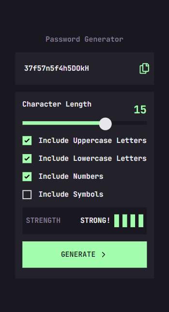
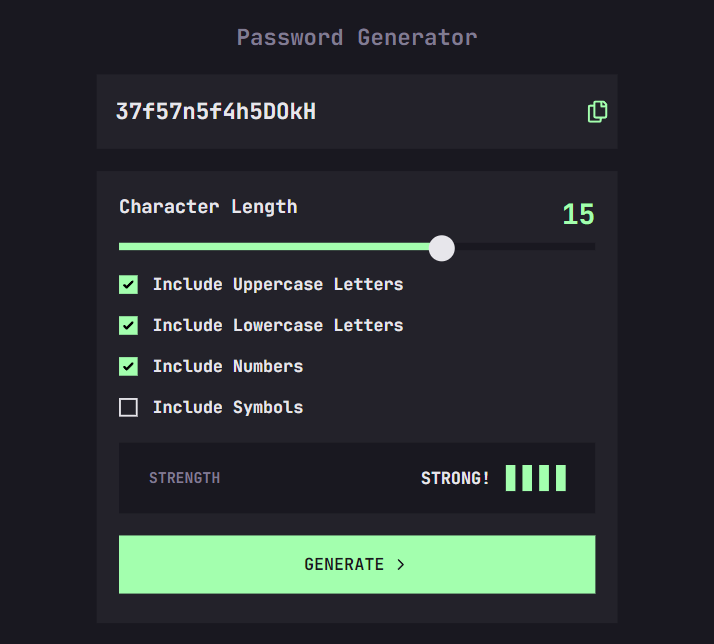

# Frontend Mentor - Password Generator App

This is a solution to the Password Generator App. Frontend Mentor challenges help you improve your coding skills by building realistic projects.

## Table of contents

- [Overview](#overview)
  - [The challenge](#the-challenge)
  - [Screenshot](#screenshot)
  - [Links](#links)
- [My process](#my-process)
  - [Built with](#built-with)
- [Author](#author)

## Overview

### The challenge

Users should be able to:

- Generate a password based on the selected inclusion options
- Copy the generated password to the computer's clipboard
- See a strength rating for their generated password
- View the optimal layout for the interface depending on their device's screen size
- See hover and focus states for all interactive elements on the page

### Screenshot

  
  

### Links

- [Live Site](https://password-generator-nine-pink.vercel.app/)

## My process

### Built with

- [React](https://reactjs.org/) - JS library
- [Tailwindcss](https://tailwindcss.com/) - For styles
- Typescript

## Author

- Frontend Mentor - [@yan-batista](https://www.frontendmentor.io/profile/yan-batista-1326)
- Github - [@yan-batista](https://github.com/yan-batista)
